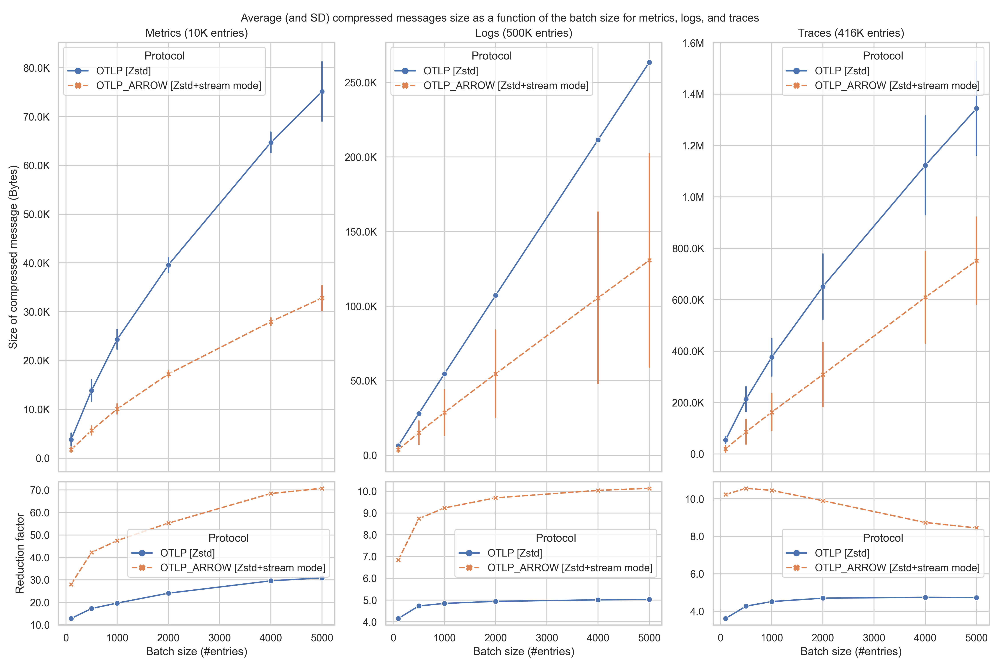
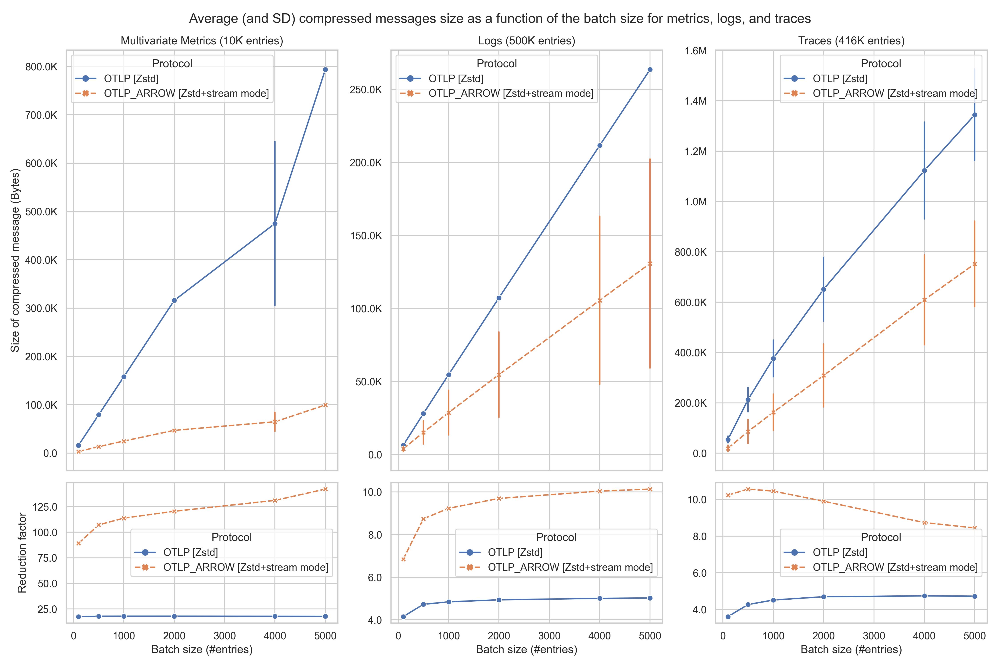
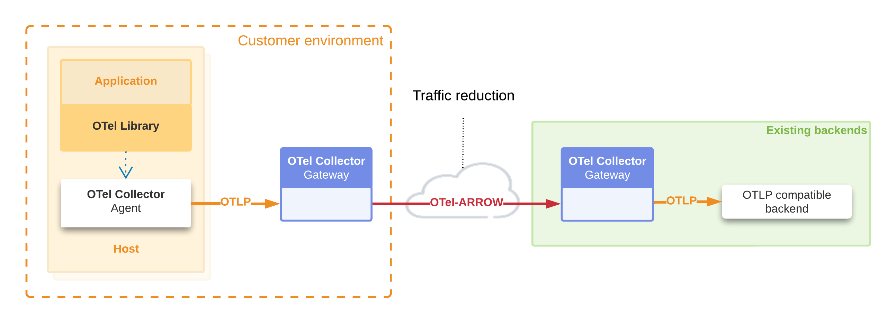

# OTel Arrow Encoder/Decoder package

This package is a reference implementation of the OTel Arrow protocol specified in this [OTEP](https://github.com/lquerel/oteps/blob/main/text/0156-columnar-encoding.md).
All OTLP entities are covered (metrics, logs, and traces) as well as all sub-elements such as events, links, gauge, sum, 
summary, histograms, ... The overall goal is to optimize the compression ratio for telemetry data transmission as well 
as the end-to-end performance between telemetry data producers and receivers.

**This package is still experimental and subject to change.** It is currently used by an [experimental OTLP/Arrow gRPC 
exporter and receiver](https://github.com/open-telemetry/experimental-arrow-collector).

Other important links:
- [OTEP/Specification](https://github.com/lquerel/oteps/blob/main/text/0156-columnar-encoding.md) describing the
  motivations, the protocol, the schemas, the benchmark results and the different phases of this project. The OTEP is
  still [pending, unmerged](https://github.com/open-telemetry/oteps/pull/171).
- [Donation proposal](https://github.com/open-telemetry/community/issues/1332) - approved, but repo not yet transferred in OTel org.
- [Slides](https://docs.google.com/presentation/d/12uLXmMWNelAyAiKFYMR0i7E7N4dPhzBi2_HLshFOLak/edit?usp=sharing) (01/30/2023 Maintainers meeting).
- [Project Roadmap](https://github.com/f5/otel-arrow-adapter/milestones?direction=asc&sort=due_date&state=open) and [project Board](https://github.com/orgs/f5/projects/1/views/2) describing the current state of the project.
- [Arrow schemas](docs/data_model.md) used by this package.
- [Threat model](docs/threat_model_assessment.md).

## Benchmark summary

The following chart shows the compressed message size (in bytes) as a function
of the batch size for metrics (univariate), logs, and traces. The bottom of the
chart shows the reduction factor for both the standard OTLP protocol and the
OTel Arrow protocol.



The next chart follows the same logic but shows the results for multivariate
metrics (left column).



See the following [benchmark results](docs/benchmarks.md) for more details.
 
## Phase 1 (current implementation)

This first step is intended to address the specific use cases of traffic reduction. Based on community feedback, many
companies want to reduce the cost of transferring telemetry data over the Internet. By adding a collector that acts as
a point of integration and traffic conversion at the edge of a client environment, we can take advantage of the columnar
format to eliminate redundant data and optimize the compression rate. This is illustrated in the following diagram.



> Note 1: A fallback mechanism can be used to handle the case where the new protocol is not supported by the target. 
> More on this mechanism in this [section](https://github.com/lquerel/oteps/blob/main/text/0156-columnar-encoding.md#protocol-extension-and-fallback-mechanism) of the OTEP. 

The experimental collector implements on top of this library a new Arrow Receiver and Exporter able to fallback on
standard OTLP when needed. The following diagram is an overview of this integration. The internal representation of the
data has not been updated and this collector is still fundamentally row-oriented internally.


> Note 2: A future phase 2 of this project will focus on implementing end-to-end OTel Arrow to improve the overall
> performance.

## Testing and validation

The testing of this package and the validation of the OTel Arrow encoding/decoding are the object of particular 
attention because of the central position of this package in the future OTel collector.

Concerning the tests, the plan is to:
- reach a test coverage close to 80% (currently ~62%).
- add more fuzz tests on the encoding and decoding of OTel Arrow messages,
- implement integration tests with the experimental collector (testbed implemented in the experimental collector).

Concerning the encoding/decoding validation, the plan is to:
- compare the OTLP entities before and after their conversion to OTel Arrow entities (done).
- test the conversion procedure of the production data via a CLI tool or directly via the integration in the 
experimental collector (wip).

A validation of the compression ratio stability is also part of the objectives. This validation will be performed on
production data (see [Help us](#tests-and-benchmarks-on-real-production-data) section).

## Help us!

### Tests and benchmarks on real production data

We strongly encourage community members to test this protocol extension on production data and report their results and
potential problems.

A beta version of this experimental collector will soon be available for this purpose. The testing procedure is described below:
- ToDo

### Developers

Pull requests are welcome. For major changes, please open an issue
first to discuss what you would like to change. For more information, please
read [CONTRIBUTING](CONTRIBUTING.md).

#### How to change the protobuf specification

To (re)generate the ArrowStreamService gRPC service, you need to install the `protoc` compiler and the `protoc-gen-grpc` plugin.
```shell
go install google.golang.org/protobuf/cmd/protoc-gen-go@v1.28
go install google.golang.org/grpc/cmd/protoc-gen-go-grpc@v1.2
export PATH="$PATH:$(go env GOPATH)/bin"
cd ./proto
./generate.sh
```
Once the `*.pb.go` files are generated, you need to replace the content of the `api/collector/arrow/v1` directory by the
generated files present in the `./proto/api/collector/arrow/v1` directory.

## Integration with the OpenTelemetry Collector

The integration of this package with the OpenTelemetry Collector is done in the following experimental repository:
* [experimental-arrow-collector](https://github.com/open-telemetry/experimental-arrow-collector)

## Project management and status

- [Project Board](https://github.com/orgs/f5/projects/1/views/2)
- Milestones:
  - [Beta 1](https://github.com/f5/otel-arrow-adapter/milestone/1)
  - [Beta 2](https://github.com/f5/otel-arrow-adapter/milestone/2)
  - [Beta 3](https://github.com/f5/otel-arrow-adapter/milestone/3)
  - [Beta 4](https://github.com/f5/otel-arrow-adapter/milestone/4)
- Not yet implemented
  - Multivariate metrics encoder/decoder
  - Complex attributes (list, map)
  - Some mitigations mentioned in the [thread model assessment](docs/threat_model_assessment.md)

## License

OTEL Arrow Adapter is licensed under Apache 2.0.
